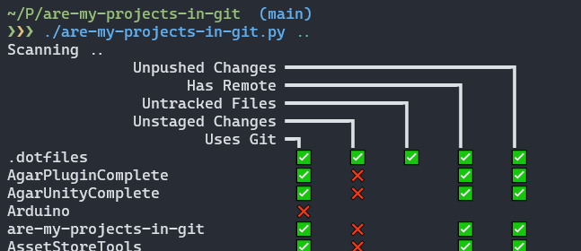

# Are my Projects in Git?

Tells you if your projects are safely stored in a remote git repo where no hard drive failures can hurt them <sup>[citation needed]</sup>.



Checks:
- Is it even tracked by git?
- Are there any unstaged changes?
- Are there any untracked files?
- Do you have a remote setup?
- Are there any unpushed files?

## Usage
The 'just show me the results for my current directory' way:
```bash
wget https://raw.githubusercontent.com/JamJar00/are-my-projects-in-git/main/are-my-projects-in-git.py -O - -q | python3 - .
```

Or the more permanent, 'maybe I want a local copy of this project' way:
```bash
git clone git@github.com:JamJar00/are-my-projects-in-git.git
cd are-my-projects-in-git

./are-my-projects-in-git.py <the directory you store your projects in>
```

## TODO
- Check all branches have a remote branch and are pushed
- Check untracked files even if there are unstaged files

PRs welcome. Make this better for me.
